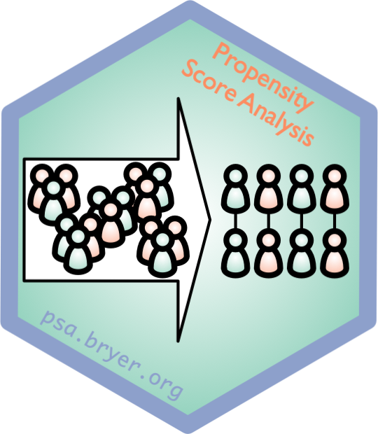
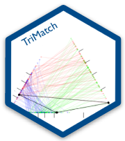
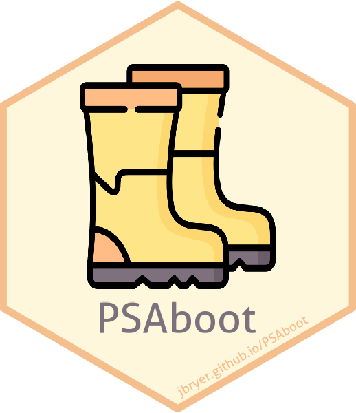
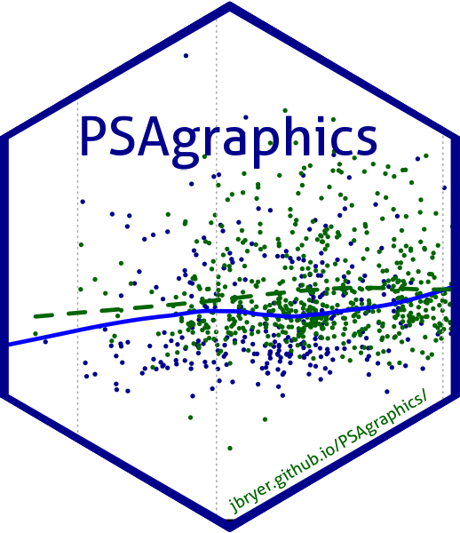
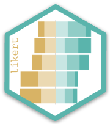
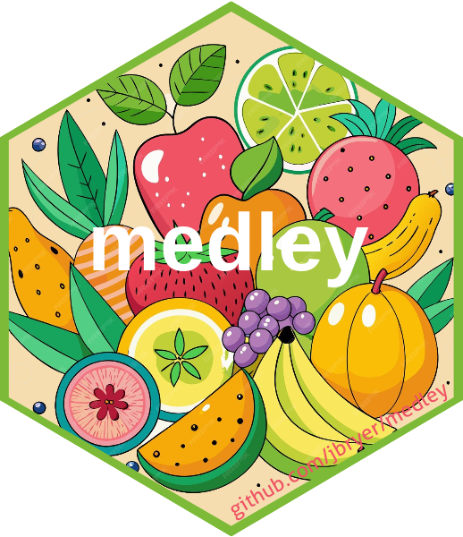
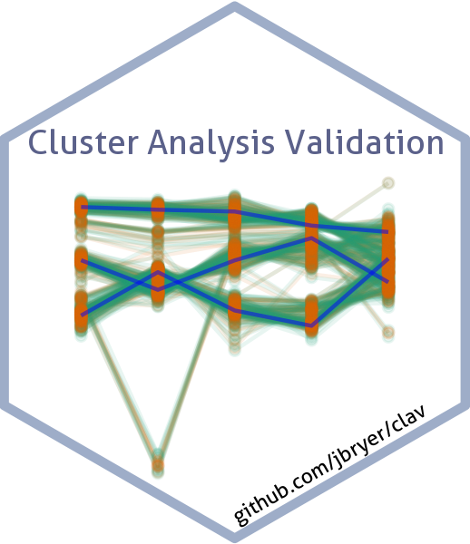
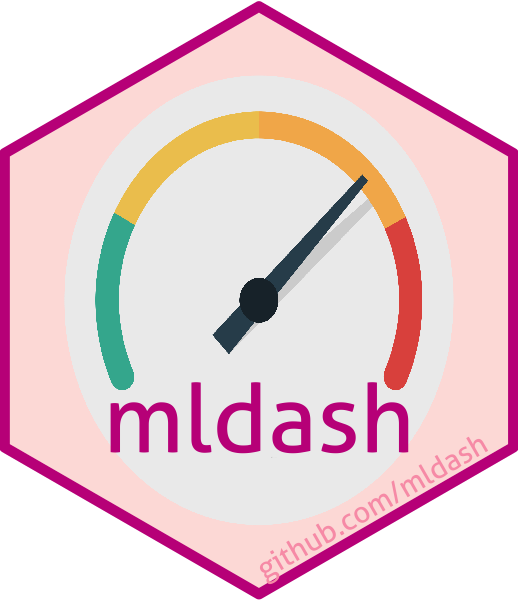

```{r setup, include = FALSE}
# Cartoons from https://github.com/allisonhorst/stats-illustrations
# dplyr based upon https://allisonhorst.shinyapps.io/dplyr-learnr/#section-welcome

source('../config.R')
library(fontawesome)
```


class: center, middle, inverse, title-slide

# `r metadata$title`
## `r metadata$subtitle`
### `r metadata$author`
### `r metadata$date`

---
# Final Exam

* Is now available on Brightspace.

* Due by midnight December 14th.

* You may use your book and course materials.

* We expect you to complete the exam on your own (i.e. do not discuss with classmates, colleagues, significant others, ChatGPT, etc.)

* There are two parts:
	1. Part one multiple choice questions and short answer questions.
	2. Part two has a small data set to analyze with R, then answer some interpretation questions.

* Put your answers in the Rmarkdown file and submit the PDF file. **Please do not post your answers online!**

---
# Announcements

* Please make sure you are in the CUNY Slack channel.
	* Professor Hagstrom has a poll regarding upcoming in-person meetups.
	
* You should join the New York Open Statistical Programming Meetup group. [https://nyhackr.org](https://nyhackr.org)
  * They meet monthly, usually at NYU. [George Hagstrom](mailto:George.Hagstrom@cuny.edu) has been organizing a group of MSDS students meeting up there each month.


---
# Propensity Score Analysis `r hexes('psa')`

My statistical research interest is in propensity score methods. Propensity score analysis (PSA) is a quasi-experimental design used to estimate causality from observational studies.

Here are some resources for PSA:

* PSA [Github repository](https://github.com/jbryer/psa) includes slides slides and Shiny application: https://github.com/jbryer/psa
* Early version of an [Intro to PSA](https://psa.bryer.org) book: https://psa.bryer.org
* Recording of a talk given in Fall 2023 for the NYC Meetup group here: https://www.youtube.com/watch?v=JLV4mtFhRMM


.pull-left[
 `multilevelPSA`<br/> [Multilevel PSA]((http://jason.bryer.org/multilevelPSA)
<br/><br/>
 `TriMatch`<br/> [Matching with non-binary treatments](http://jason.bryer.org/TriMatch)

]
.pull-right[
 `PSAboot`<br/> [Bootstrapping PSA](http://jason.bryer.org/PSAboot)
<br/><br/>
 `PSAgraphics`<br/> [Graphical analysis of PSA](http://jason.bryer.org/PSAgraphics)
]


---
# R Packages

Here is list of some other R related projects I have worked on:

 [`likert`](https://github.com/jbryer/likert) - Analysis and Visualization of Likert Based Items  
 [`ShinyQDA`](https://github.com/jbryer/ShinyQDA) - R Package and Shiny Application for the Analysis of Qualitative Data  
 [`medley`](https://github.com/jbryer/medley) - Predictive modeling with missing data  
 [`clav`](https://github.com/jbryer/clav) - Cluster Analysis Validation  
 [`IRRsim`](https://github.com/jbryer/IRRsim) - An R Package for Simulating Inter-Rater Reliability  
 [`mldash`](https://github.com/jbryer/mldash) - Machine Learning Dashboard  
 [AmplifyApp](https://amplifyapp.org/en), [dashboard](https://amplifyapp.org/en), and [Future Mapping NYC](https://futuremapping.org)

---
# DAACS

[The Diagnostic Assessment and Achievement of College Skills](https://daacs.net) (DAACS) is a suite of technological and social supports to optimize student learning. DAACS  provides personalized feedback about students’ strengths and weaknesses in  terms of key academic and self-regulated learning skills, linking them to the resources to help them be successful students. This is currently supported by a five-year $3.8 million grant received in 2021 from the Institute of Education Sciences to test the efficacy at three institutions.

Applications of Data Science:

* We use natural language processing and predictive models to machine score the essays.
  * We had a student this semester work with us to explore whether we can detect AI generated essays specific to the DAACS writing prompt (answer: we)
* We use DAACS data to estimate "risk scores" for students failing so we can target them with resources to help them be successful.
  * Related to this, we have developed a new R package for estimated predictive models with missing data, see [medley](https://github.com/jbryer/medley).


---
# Thank You

This has been a great semester. Please don't hesitate to reach out:

`r fa('envelope')` Email: [jason.bryer@cuny.edu](mailto:jason.bryer@cuny.edu)
`r fa('github')` Github: https://github.com/jbryer
`r fa('link')` Personal Website: https://bryer.org
`r fa('linkedin')` LinkedIn: [jasonbryer](https://www.linkedin.com/in/jasonbryer/)
`r fa('mastodon')` Mastodon: [@jbryer@vis.social](https://vis.social/@jbryer)


<br/>

You can download all course materials on [Github](https://github.com/jbryer/`r github_link`). Click the [clone or download](https://github.com/jbryer/`r github_link`/archive/master.zip) link to download a zip file.

